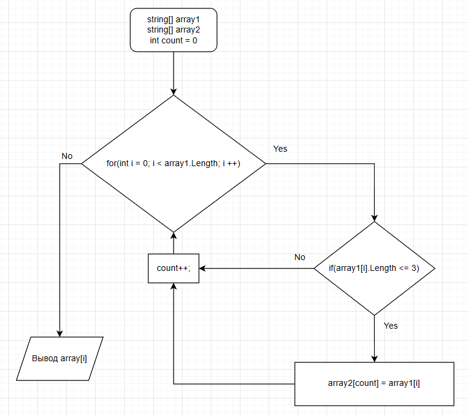

# Итоговая проверочная работа.

## Задача:

### Написать программу, которая из имеющегося массива строк формирует массив из строк, длина которых меньше либо равна 3 символа. Первоначальный массив можно ввести с клавиатуры, либо задать на старте выполнения алгоритма. При решение не рекомендуется пользоваться коллекциями, лучше обойтись исключительно массивами.

## 1. Описание решения задачи.
### Объявляем два массива изначальный и второй такого же размера. Объявляем метод, в котором цикл соразмерный массиву, внутри цикла проверка условия ( <=3 ), если да элемент первого массива заносится в count элемент второго массива. Временная переменная count предназначена для поочередного переноса из изначального массива во второй. После присвоения увеличивается переменная count на 1 и возвращается к циклу for в котором i увеличивается на 1. Цикл повторяется до окончания изначального массива.

## 2. Блок-схема решения задачи.

## 3. Программа решения задачи.
### Ссылка на файл c решенем задачи -> [Program.cs](Program/Program.cs) 